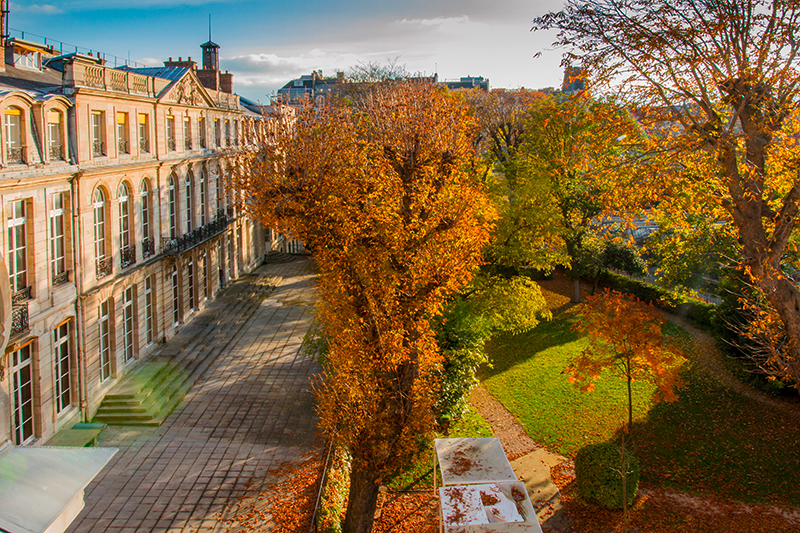

---
jupytext:
  cell_metadata_json: true
  encoding: '# -*- coding: utf-8 -*-'
  text_representation:
    extension: .md
    format_name: myst
    format_version: 0.13
    jupytext_version: 1.19.5
kernelspec:
  display_name: Python 3 (ipykernel)
  language: python
  name: python3
---

# TP images (2/2)

merci à Wikipedia et à stackoverflow

```{admonition} disclaimer
:class: danger

**le but de ce TP n'est pas d'apprendre le traitement d'image - on se sert d'images pour égayer des exercices avec `numpy`  
(et parce que quand on se trompe ça se voit)**
```

```{code-cell} ipython3
import numpy as np
from matplotlib import pyplot as plt
```

+++ {"tags": ["framed_cell"]}

````{admonition} → **notions intervenant dans ce TP**

* sur les tableaux `numpy.ndarray`
  * `reshape()`, masques booléens, *ufunc*, agrégation, opérations linéaires
  * pour l'exercice `patchwork`:  
    on peut le traiter sans, mais l'exercice se prête bien à l'utilisation d'une [indexation d'un tableau par un tableau - voyez par exemple ceci](https://numerique.info-mines.paris/numpy-optional-indexing-nb/)

  * pour l'exercice `sepia`:  
    ici aussi on peut le faire "naivement" mais l'utilisation de `np.dot()` peut rendre le code beaucoup plus court

* pour la lecture, l'écriture et l'affichage d'images
  * utilisez `plt.imread()`, `plt.imshow()`
  * utilisez `plt.show()` entre deux `plt.imshow()` si vous affichez plusieurs images dans une même cellule

  ```{admonition} **note à propos de l'affichage**
  :class: seealso dropdown admonition-small

  * nous utilisons les fonctions d'affichage d'images de `pyplot` par souci de simplicité
  * nous ne signifions pas là du tout que ce sont les meilleures!  
    par exemple `matplotlib.pyplot.imsave` ne vous permet pas de donner la qualité de la compression  
    alors que la fonction `save` de `PIL` le permet

  * vous êtes libres d'utiliser une autre librairie comme `opencv`  
    si vous la connaissez assez pour vous débrouiller (et l'installer), les images ne sont qu'un prétexte...
  ```
````

+++

## Création d'un patchwork

### v1

on se propose d'écrire un code pour créer des tableaux dans le genre de celui-ci (affiché avec `plt.imshow`):


```{code-cell} ipython3
# pour cela on se définirait par exemple
colors = np.array([
[255, 0, 0],
[0, 255, 0],
[0, 0, 255],
[255, 255, 0],
[255, 0, 255],
])
```

après quoi on appellerait la fonction `patchwork` - que vous allez devoir écrire - comme ceci:

```python
plt.imshow(patchwork(colors))
```

remarquez les choses suivantes:

- si par exemple on avait passé 9 couleurs, on aurait créé un carré 3x3, mais comme ici on a passé à la fonction une liste de 5 couleurs, pour que ça tienne dans un rectangle, on se décide sur un rectangle de taille 2x3
- la taille totale de l'image est de 10x15, car par défaut chaque petite tuile a une taille de 5 pixels
- du coup le dernier carré est rempli avec une couleur par défaut - ici DarkGray
  (dans la v2 on pourra utiliser les couleurs par leur nom, mais n'anticipons pas; pour l'instant notez que DarkGray c'est 169, 169, 169) 

on va permettre à l'appelant de changer ces valeurs par défaut  
ça signifie que si on appelait

```python
# cette fois on passe 10 couleurs (colors + colors est une liste de 10 couleurs)
# et on fixe la taille des tuiles, et la couleur de fond noire
plt.imshow(patchwork(colors + colors, side=10, background=[0, 0, 0]))
```

on obtiendrait cette fois (observez la taille en pixels de l'image)


+++

**exercice**

+++

1. écrivez une fonction `rectangle_size` qui calcule la taille du rectangle en fonction du nombre de couleurs

```{admonition} indice
:class: tip dropdown

* votre fonction retourne un tuple avec deux morceaux: le nombre de lignes, et le nombre de colonnes
* dans un premier temps, vous pouvez vous contenter d'une version un peu brute: on pourrait utiliser juste la racine carrée, et toujours fabriquer des carrés
  
  par exemple avec 5 couleurs créer un carré 3x3 (et remplir les 4 cases restantes avec la couleur de fond)

* mais si vous avez le temps, pour 5 couleurs, un rectangle 3x2 c'est quand même mieux !

  voici pour vous aider à calculer le rectangle qui contient n couleurs

  n | rect | n | rect | n | rect | n | rect |
  -|-|-|-|-|-|-|-|
  1 | 1x1 | 5 | 2x3 | 9 | 3x3 | 14 | 4x4 |
  2 | 1x2 | 6 | 2x3 | 10 | 3x4 | 15 | 4x4 |
  3 | 2x2 | 7 | 3x3 | 11 | 3x4 | 16 | 4x4 |
  4 | 2x2 | 8 | 3x3 | 12 | 3x4 | 17 | 4x5 |
```

```{code-cell} ipython3
# votre code

def rectangle_size(n):
    m = int(np.ceil(np.sqrt(n)))
    if m * (m-1) < n:
        return (m,m)
    else:
        return (m-1,m)
rectangle_size(10)
```

2. écrivez la fonction `patchwork` telle que décrite en préambule

````{admonition} indices
:class: dropdown

* sont potentiellement utiles pour cet exo:
  * la fonction `np.indices()`
  * [l'indexation d'un tableau par un tableau](https://numerique.info-mines.paris/numpy-optional-indexing-nb/)
* souvenez-vous que chaque "tuile" a une taille réglable
* et qu'il vous faut peindre les tuiles surnuméraires avec une couleur de fond paamétrable
````

```{code-cell} ipython3
# votre code 

def patchwork(colors, side=10, background=[169, 169, 169]):
    """
    - colors is expected to be a list of n colors; it can be either
      * a list like e.g. [[255, 0, 0], [0, 255, 0], ... ]
      * or a numpy array of shape n, 3
    - side is the "width" of each square
    - optional background it used to pad the rest of the image when
      the <n> colors are not enough to fill a rectangle
      here we use DarkGray as the default
    """
    # your code here
    n = len(colors)
    (i,j) = rectangle_size(n)
    pattern = np.arange(i*j).reshape((i,j))
    pattern = np.where(pattern >= n-1, n-1, pattern)
    plt.imshow(colors[pattern])
```

```{code-cell} ipython3
# si vous voulez tester
plt.imshow(patchwork(colors, side=10, background=[169, 169, 169]));
```

```{code-cell} ipython3
# si vous voulez tester
plt.imshow(patchwork(colors+colors, side=10, background=[0, 0, 0]))
```

### v2 (optionnel)

dans cette version, on a envie de pouvoir faire essentiellement la même chose, mais avec des **noms de couleurs**

et pour cela on vous fournit un **fichier textuel de description des couleurs** qui se trouve dans `data/rgb-codes.txt` et qui ressemble à ceci:

```text
AliceBlue 240 248 255
AntiqueWhite 250 235 215
Aqua 0 255 255
.../...
YellowGreen 154 205 50
```
Comme vous le devinez, le nom de la couleur est suivi des 3 valeurs 
de ses codes `R`, `G` et `B`

```{code-cell} ipython3
# with patchwork v2 one could use this data

color_names = [
    'DarkBlue', 'AntiqueWhite', 'LimeGreen', 'NavajoWhite',
    'Tomato', 'DarkGoldenrod', 'LightGoldenrodYellow', 'OliveDrab',
    'Red', 'Lime',
]
```

et ce qu'on veut, c'est pouvoir faire par exemple

```python
patchwork2(color_names)
```

pour obtenir ceci


+++

**exercice**

+++

1. lisez le fichier des couleurs en `Python`, et rangez cela dans la structure de données qui vous semble adéquate.

```{code-cell} ipython3
import re

color_dict = {}

with open("data/rgb-codes.txt", "r", encoding="utf-8") as f:
    for line in f:
        line = line.strip()
        if not line:
            continue

        # Utilisation d'un regex pour capturer le nom et les 3 valeurs RGB
        match = re.match(r"^([A-Za-z]+)\s+(\d+)\s+(\d+)\s+(\d+)$", line)
        if match:
            name, r, g, b = match.groups()
            color_dict[name] = [int(r), int(g), int(b)]
```

```{raw-cell}
2. Affichez, à partir de votre structure, les valeurs rgb entières des couleurs suivantes  
`'Red'`, `'Lime'`, `'Blue'`
```

```{code-cell} ipython3
color_dict['Red']
color_dict['Lime']
color_dict['Blue']
```

3. Faites une fonction `patchwork2` qui fait ce qu'on veut

   Testez votre fonction en affichant le résultat obtenu sur un jeu de couleurs fourni

````{admonition} un commentaire
:class: tip admonition-small

telle qu'on l'a appelée ci-dessus i.e. `patchwork(color_names)`, on n'a pas prévu de passer en paramètre la table des couleurs - je veux dire la structure qu'on a construite à l'étape 1

c'est principalement pour simplifier: utilisez cette structure comme une variable globale ! 

bon sachez juste que dans la vraie vie, on évite cette pratique de passer par une variable globale; il y a plein de façons de faire ça, mais ce n'est pas notre sujet aujourd'hui, et on va rester simple :)

````

```{code-cell} ipython3
def patchwork2(color_names, side=10, background="DarkGray"):
    colors2 = np.array([color_dict[name] for name in color_names])
    background2 = color_dict[background]
    return patchwork(colors2, side=side, background=background2)
```

```{code-cell} ipython3
# ou encore

plt.imshow(patchwork2(color_names, side=20, background="DarkGray"));
```

```{code-cell} ipython3
# et pour le tester

plt.imshow(patchwork2(color_names));
```

4. Tirez aléatoirement une liste de couleurs et appliquez votre fonction à ces couleurs.

```{code-cell} ipython3
m = np.random.randint(len(color_dict))
lst_couleur = np.random.randint(0, len(color_dict), m)
cle = list(color_dict.keys())
color_names3 = np.array([cle[i] for i in lst_couleur])
patchwork2(color_names3, side=10, background="DarkGray")
```

5. Sélectionnez toutes les couleurs à base de blanc (i.e. dont le nom contient `white`) et affichez leur patchwork  
   même chose pour des jaunes

```{code-cell} ipython3
color_names4 = []
for elt in cle:
    if "white" in elt.lower():
        color_names4.append(elt)
patchwork2(color_names4, side=10, background="DarkGray")

for elt in cle:
    if "yellow" in elt.lower():
        color_names4.append(elt)
patchwork2(color_names4, side=10, background="DarkGray")
```

6. Appliquez la fonction à toutes les couleurs du fichier  
et sauver ce patchwork dans le fichier `patchwork.png` avec `plt.imsave`

```{code-cell} ipython3
img = patchwork2(cle, side=10, background="DarkGray")
plt.imsave("patchwork.png", img)
```

7. Relisez et affichez votre fichier  
   attention si votre image vous semble floue c'est juste que l'affichage grossit vos pixels

```{code-cell} ipython3
# votre code
```

vous devriez obtenir quelque chose comme ceci

```{image} media/patchwork-all.jpg
:width: 400px
:align: center
```

+++

## Image en sépia

+++

Pour passer en sépia les valeurs R, G et B d'un pixel, on applique la transformation suivante
```text
R' = 0.393 * R + 0.769 * G + 0.189 * B
G' = 0.349 * R + 0.686 * G + 0.168 * B
B' = 0.272 * R + 0.534 * G + 0.131 * B
```

```{admonition} notes sur les types

* dans notre cas on suppose qu'en entrée on a des entiers non-signé 8 bits
* mais attention, les calculs vont devoir se faire en flottants, et pas en uint8  
pour ne pas avoir, par exemple, 256 devenant 0

* toutefois on veut tout de même en sortie des entiers non-signé 8 bits !

ça signifie qu'il va sans doute vous falloir faire un peu de gymnastique avec les types de vos tableaux
```

+++

````{tip} indice
vous devriez jeter un coup d'oeil à la fonction `np.dot` qui est, si on veut, une généralisation du produit matriciel  
et dont voici un exemple d'utilisation:
````

```{code-cell} ipython3
# exemple de produit de matrices avec `numpy.dot`
# le help(np.dot) dit: dot(A, B)[i,j,k,m] = sum(A[i,j,:] * B[k,:,m])

i, j, k, m, n = 2, 3, 4, 5, 6
A = np.arange(i*j*k).reshape(i, j, k)
B = np.arange(m*k*n).reshape(m, k, n)

C = A.dot(B)
# or C = np.dot(A, B)

print(f"en partant des dimensions {A.shape} et {B.shape}")
print(f"on obtient un résultat de dimension {C.shape}")
print(f"et le nombre de termes dans chaque `sum()` est {A.shape[-1]} == {B.shape[-2]}")
```

**Exercice**

+++

1. Faites une fonction `sepia` qui prend en argument une image RGB et rend une image RGB sépia

```{code-cell} ipython3
def sepia2(im):
    A = np.array([[0.393, 0.769, 0.189], [0.349, 0.686, 0.168], [0.272, 0.534, 0.131]])
    A = A.T
    B = im.dot(A)
    plt.imshow(B.astype(int))
```

2. Passez l'image `data/les-mines.jpg` en sépia

```{code-cell} ipython3
img = plt.imread("data/les-mines.jpg")
sepia2(img)
```

Voici ce que vous devriez obtenir avec l'images des Mines

````{grid} 2 2 2 2
```{card}
:header: l'original

```
```{card}
:header: la version sepia

```
````

+++

## Somme dans une image & overflow

+++

0. Lisez l'image `data/les-mines.jpg`

```{code-cell} ipython3
img = plt.imread("data/les-mines.jpg")
```

1. Créez un nouveau tableau `numpy.ndarray` en sommant **avec l'opérateur `+`** les valeurs RGB des pixels de votre image

```{code-cell} ipython3
rouge = img[:,:,0]
vert = img[:,:,1]
bleu = img[:,:,2]
img2 = rouge+vert+bleu
```

2. Regardez le type de cette image-somme, et son maximum; que remarquez-vous?  
   Affichez cette image-somme; comme elle ne contient qu'un canal il est habile de l'afficher en "niveaux de gris" (normalement le résultat n'est pas terrible ...)


   ```{admonition} niveaux de gris ?
   :class: dropdown tip

   cherchez sur google `pyplot imshow cmap gray`
   ```

```{code-cell} ipython3
print(type(img2))
np.max(img2)
plt.imshow(img2, cmap='gray', vmin=0, vmax=255)
plt.colorbar()
plt.show()
```

3. Créez un nouveau tableau `numpy.ndarray` en sommant mais cette fois **avec la fonction d'agrégation `np.sum`** les valeurs RGB des pixels de votre image

```{code-cell} ipython3
img3 = img.sum(axis = 2)
print(img3)
```

4. Comme dans le 2., regardez son maximum et son type, et affichez la

```{code-cell} ipython3
print(type(img3))
np.max(img3)
plt.imshow(img3, cmap='gray', vmin=0, vmax=255)
plt.colorbar()
plt.show()
```

5. Les deux images sont de qualité très différente, pourquoi cette différence ? Utilisez le help `np.sum?`

```{code-cell} ipython3
# votre code / explication
La méthode consistant à faire rouge + vert + bleu aboutira en cas de dépassement à un entier modulo 256 à cause de l'encodage uint8. On a donc des zones sombres indésirables.
Cependant, pour la méthode np.sum, le nombre final sera convertit sur 32 bits en cas de dépassement, on a ainsi des zones très blanches, mais un cintraste très élevé en sortie.
```

6. Passez l'image en niveaux de gris de type entiers non-signés 8 bits  
(de la manière que vous préférez)

```{code-cell} ipython3
img_gris_uint8 = img3.astype(np.uint8)
```

7. Remplacez dans l'image en niveaux de gris,  
les valeurs >= à 127 par 255 et celles inférieures par 0  
Affichez l'image avec une carte des couleurs des niveaux de gris  
vous pouvez utilisez la fonction `numpy.where`

```{code-cell} ipython3
img_finale = np.where(img_gris_uint8>=127,255,0)
plt.imshow(img_finale, cmap='gray', vmin=0, vmax=255)
plt.colorbar()
plt.show()
```

8. avec la fonction `numpy.unique`  
regardez les valeurs différentes que vous avez dans votre image en noir et blanc

```{code-cell} ipython3
# votre code
valeurs_uniques = np.unique(img_finale)
print(valeurs_uniques)
```

## Exemple de qualité de compression

+++

1. Importez la librairie `Image`de `PIL` (pillow)  
(vous devez peut être installer PIL dans votre environnement)

```{code-cell} ipython3
import os
from PIL import Image
```

2. Quelle est la taille du fichier `data/les-mines.jpg` sur disque ?

```{code-cell} ipython3
file = "data/les-mines.jpg"
```

```{code-cell} ipython3
poids = os.path.getsize("data/les-mines.jpg")
print(poids)
```

3. Lisez le fichier 'data/les-mines.jpg' avec `Image.open` et avec `plt.imread`

```{code-cell} ipython3
# votre code
img4 = Image.open("data/les-mines.jpg")
img5 = plt.imread("data/les-mines.jpg")
```

4. Vérifiez que les valeurs contenues dans les deux objets sont proches

```{code-cell} ipython3
img6 = img4 - img5
print(img6)
#c'est que des 0, donc c'est bon
```

5. Sauvez (toujours avec de nouveaux noms de fichiers)  
l'image lue par `imread` avec `plt.imsave`  
l'image lue par `Image.open` avec `save` et une `quality=100`  
(`save` s'applique à l'objet créé par `Image.open`)

```{code-cell} ipython3
plt.imsave("img5.png",img5)
img4.save("img4.jpg", quality=100)
```

6. Quelles sont les tailles de ces deux fichiers sur votre disque ?  
Que constatez-vous ?

```{code-cell} ipython3
"img4 (qui provient de .imsave) est beaucoup plus lourde (1123Ko) que img5 (qui vient de .save) qui pèse (560Ko)."
```

7. Relisez les deux fichiers créés et affichez avec `plt.imshow` leur différence

```{code-cell} ipython3
img_png = plt.imread("img5.png")
img_jpg = plt.imread("img4.jpg")
if img_png.dtype != np.uint8:
    img_png = (img_png[:, :, :3] * 255).astype(float)
else:
    img_png = img_png[:, :, :3].astype(float)
img_jpg = img_jpg.astype(float)
diff2 = img_png - img_jpg
plt.figure(figsize=(6, 6))
plt.imshow(diff2.astype(np.uint8))
plt.show()
```

```{code-cell} ipython3

```
